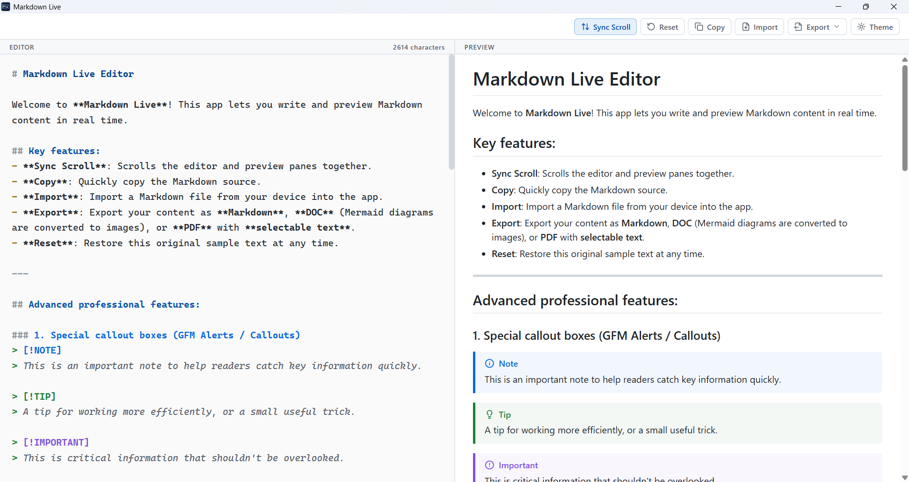
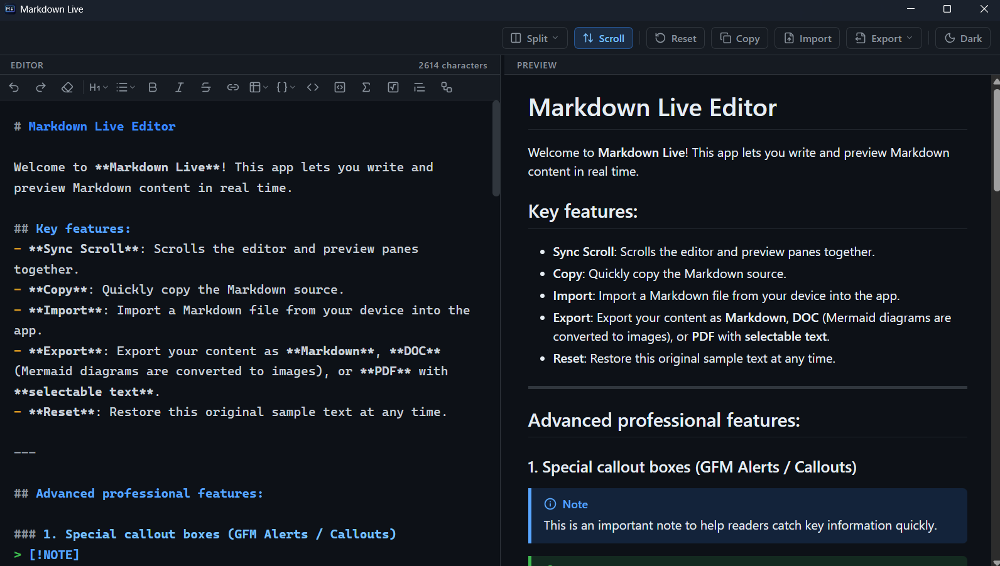

<div align="center">


# Markdown Live

Trình soạn thảo Markdown hai chiều thời gian thực hoạt động độc lập, ngoại tuyến (Offline-first) được đóng gói trên nền tảng Tauri v2.

[](https://tauri.app/)

[](https://developer.mozilla.org/)
[](https://github.com/uytran0610/markdown-live-app/releases)
[](LICENSE)

</div>

---

## Mục lục

- [Tổng quan kiến trúc](#tổng-quan-kiến-trúc)
- [Tính năng kỹ thuật](#tính-năng-kỹ-thuật)
- [Ảnh chụp màn hình](#ảnh-chụp-màn-hình)
- [Công nghệ sử dụng](#công-nghệ-sử-dụng)
- [Bắt đầu nhanh](#bắt-đầu-nhanh)
- [Cách sử dụng](#cách-sử-dụng)
- [Hướng dẫn xuất PDF](#hướng-dẫn-xuất-pdf)
- [Cấu trúc dự án](#cấu-trúc-dự-án)
- [Đóng góp](#đóng-góp)
- [Giấy phép](#giấy-phép)

---

## Tổng quan kiến trúc

Markdown Live được thiết kế với mục tiêu tối ưu hiệu năng bộ nhớ và tốc độ phản hồi. Ứng dụng sử dụng kiến trúc hybrid:
- **Core Runtime:** Tauri v2 (Rust backend) đảm bảo kích thước binary nhỏ gọn, quản lý clipboard native và API hệ thống với mức tiêu hao tài nguyên thấp.
- **Frontend Layer:** Hoàn toàn bằng Vanilla JavaScript/HTML5/CSS3. Không sử dụng Single Page Application (SPA) framework nặng nề, toàn bộ dependencies thư viện được lưu trữ cục bộ (`vendor/`), không phụ thuộc mạng CDN ngoài.

> [!NOTE]
> Ứng dụng chạy hoàn toàn offline. Mọi quá trình parse Markdown, biên dịch công thức Toán học KaTeX và vẽ biểu đồ Mermaid đều được thực thi trực tiếp tại Webview client-side.

---

## Tính năng kỹ thuật

- **Dual-Pane Bidirectional Sync:** Soạn thảo song song cùng màn hình render với độ trễ gần như bằng 0.
- **GFM Alert Specifications:** Tương thích chuẩn Markdown Alerts của GitHub (`NOTE`, `TIP`, `IMPORTANT`, `WARNING`, `CAUTION`).
- **LaTeX Math Rendering:** Tích hợp KaTeX parser cho công thức nội dòng (`$...$`) và dạng khối (`$$...$$`).
- **Diagrams as Code:** Tích hợp Mermaid.js engine biên dịch biểu đồ luồng (Flowchart), biểu đồ tuần tự (Sequence), biểu đồ quan hệ (ERD).
- **Code Syntax Highlighting:** Tự động phát hiện và định dạng mã nguồn đa ngôn ngữ thông qua Highlight.js.
- **Dynamic Syntax Overlay:** Khung textarea được xử lý đồng bộ màu cú pháp Markdown trực tiếp.
- **Vector PDF Print Engine:** Khả năng trích xuất PDF dạng vector (văn bản giữ nguyên khả năng highlight/copy, không bị rasterize thành ảnh).
- **Light/Dark Theme:** Tự động nhận diện theme hệ thống, cho phép chuyển đổi thủ công và ghi nhớ lựa chọn giữa các lần mở ứng dụng.

---

## Ảnh chụp màn hình





---

## Công nghệ sử dụng

| Phân hệ | Công nghệ / Thư viện | Vai trò |
| :--- | :--- | :--- |
| **Backend Core** | Tauri v2, Rust | Quản trị cửa sổ, Clipboard Manager, Opener Plugin |
| **Markdown Parser**| Marked.js + DOMPurify | Phân tích cú pháp Markdown và lọc XSS an toàn |
| **Mathematics** | KaTeX + marked-katex-extension | Xử lý công thức Toán học TeX/LaTeX |
| **Diagram Engine** | Mermaid.js | Render biểu đồ từ cú pháp khai báo |
| **Code Engine** | Highlight.js | Tô màu cú pháp khối mã lệnh |
| **Iconography** | Lucide Icons | Hệ thống icon giao diện người dùng |

---

## Bắt đầu nhanh

### Tải bản dựng sẵn (khuyến nghị cho người dùng)

Bản thực thi portable cho Windows (`.exe`) được build tự động qua GitHub Actions mỗi khi có tag phát hành mới. Tải bản mới nhất tại trang **[Releases](https://github.com/uytran0610/markdown-live-app/releases)**, không cần cài đặt gì thêm — chỉ cần chạy file `Markdown-Live-Portable.exe`.

### Chạy từ mã nguồn (dành cho lập trình viên)

**Yêu cầu hệ thống:**
- [Node.js](https://nodejs.org/) phiên bản 20 trở lên
- [Rust toolchain](https://www.rust-lang.org/tools/install) (bản ổn định mới nhất)
- Các thư viện phụ thuộc hệ thống của Tauri v2 theo hướng dẫn tại [Tauri Prerequisites](https://tauri.app/start/prerequisites/)

**Các bước thực hiện:**

```bash
# 1. Clone repository
git clone https://github.com/uytran0610/markdown-live-app.git
cd markdown-live-app

# 2. Cài đặt dependencies
npm install

# 3. Chạy ở chế độ phát triển (dev, hot-reload)
npm run tauri dev

# 4. Build bản phát hành (installer NSIS/MSI)
npm run tauri build
```

---

## Cách sử dụng

Sau khi mở ứng dụng, gõ hoặc dán nội dung Markdown vào khung **EDITOR** bên trái, kết quả sẽ render tức thời ở khung **PREVIEW** bên phải. Thanh công cụ phía trên cung cấp các thao tác nhanh:

| Nút | Chức năng |
| :--- | :--- |
| **Sync Scroll** | Bật/tắt đồng bộ cuộn trang giữa Editor và Preview |
| **Reset** | Khôi phục nội dung ví dụ mặc định |
| **Copy** | Sao chép toàn bộ nội dung Markdown vào clipboard |
| **Export PDF** | Xuất nội dung Preview thành file PDF dạng vector, chọn được văn bản |
| **Theme** | Chuyển đổi giao diện Sáng / Tối |

### Phím tắt trong Editor

Khung soạn thảo hỗ trợ sẵn các phím tắt định dạng và chỉnh sửa quen thuộc như trong các trình soạn thảo mã nguồn:

| Phím tắt | Chức năng |
| :--- | :--- |
| `Ctrl`/`Cmd` + `B` | In đậm đoạn văn bản đang chọn |
| `Ctrl`/`Cmd` + `I` | In nghiêng đoạn văn bản đang chọn |
| `Ctrl`/`Cmd` + `Shift` + `X` | Gạch ngang giữa chữ (Strikethrough) |
| `Ctrl`/`Cmd` + `E` hoặc `Ctrl` + phím backtick | Bọc đoạn chọn thành code inline |
| `Ctrl`/`Cmd` + `K` | Chèn liên kết, tự động bôi đen phần `url` để dán nhanh |
| `Ctrl`/`Cmd` + `D` | Nhân bản dòng hiện tại (hoặc vùng đang chọn) |
| `Ctrl`/`Cmd` + `Z` | Hoàn tác (Undo) |
| `Ctrl`/`Cmd` + `Y` hoặc `Ctrl`/`Cmd` + `Shift` + `Z` | Làm lại (Redo) |
| `Tab` / `Shift` + `Tab` | Thụt lề / hủy thụt lề — dùng được cả khi bôi đen nhiều dòng |
| `Enter` | Tự động giữ thụt lề, tiếp tục danh sách (`-`, `1.`, `>`, task list) hoặc thoát danh sách nếu dòng đang trống |
| Gõ `(`, `[`, `{`, nháy đơn/kép, backtick, `*`, `_`, `~` hoặc `$` khi đang bôi đen | Tự động bao đoạn đang chọn bằng đúng ký hiệu vừa gõ |

---

## Hướng dẫn xuất PDF

> [!IMPORTANT]
> **Cấu hình Print Engine của hệ thống:**
> Để bản in hoặc file xuất PDF giữ nguyên toàn bộ nền màu, định dạng Alert Callouts và khối mã nguồn:
> 1. Trong hộp thoại in của hệ thống (Print Dialog), mở rộng danh mục **More settings (Cài đặt khác)**.
> 2. Bật tùy chọn **Background graphics (Đồ họa nền)**.

---

## Cấu trúc dự án

```
markdown-live-app/
├── src/                    # Frontend (HTML/CSS/JS thuần)
│   ├── index.html
│   ├── script.js
│   ├── style.css
│   └── vendor/             # Thư viện bên thứ 3 lưu cục bộ (marked, katex, mermaid...)
├── src-tauri/              # Backend Rust + cấu hình Tauri
│   ├── src/
│   │   ├── lib.rs
│   │   └── main.rs
│   ├── capabilities/
│   ├── icons/
│   └── tauri.conf.json
└── .github/workflows/      # CI/CD tự động build & release
```

---

## Đóng góp

Mọi đóng góp đều được hoan nghênh! Nếu bạn muốn cải thiện dự án:

1. Fork repository và tạo nhánh mới (`git checkout -b feature/ten-tinh-nang`).
2. Thực hiện thay đổi và commit rõ ràng, dễ hiểu.
3. Đảm bảo `npm run tauri dev` chạy ổn định trước khi gửi Pull Request.
4. Mở Pull Request kèm mô tả ngắn gọn về thay đổi.

Nếu phát hiện lỗi hoặc có đề xuất tính năng, vui lòng tạo [Issue](https://github.com/uytran0610/markdown-live-app/issues) mới.

---

## Giấy phép

Phát hành dưới giấy phép [MIT](LICENSE).